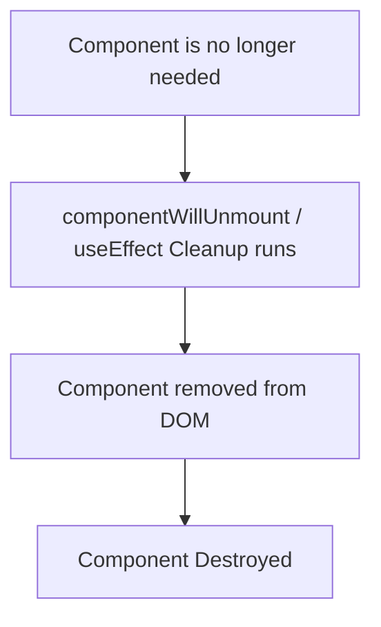

## Master React Component Lifecycle

We'll explore the component lifecycle from two perspectives: the practical, real-time development view and the theoretical, interview-focused understanding.

-----

## Part 1: Real-Time Understanding

React components have three main lifecycle phases: **Mounting**, **Updating**, and **Unmounting**.

### 1\. Mounting Phase

This phase occurs when an instance of a component is being created and inserted into the DOM for the very first time.

**What happens:**

1.  **Initialization:** The component prepares its initial state and props.
2.  **Rendering:** React creates the virtual DOM representation of the component.
3.  **DOM Insertion:** React "mounts" the component by inserting its actual DOM elements into the browser's DOM.

**Class Component Lifecycle Methods:**

  * **`constructor(props)`:**
      * **Purpose:** The very first method called when the component is created.
      * **Use Cases:** Initialize local state (`this.state = {}`), bind event handler methods. **Never perform side effects (like API calls) here.**
      * **Timing:** Before anything else, even before `render()`.
  * **`static getDerivedStateFromProps(props, state)`:**
      * **Purpose:** Seldom used. It's invoked right before calling the `render` method, both on initial mount and on subsequent updates. It exists for rare cases where state depends on changes in props over time.
      * **Use Cases:** Returns an object to update the state, or `null` to indicate no state change. **Does not have access to `this`.**
  * **`render()`:**
      * **Purpose:** The only required method in a class component. It reads `this.props` and `this.state` and returns JSX.
      * **Use Cases:** Defines the UI of the component. **Must be a pure function** – no side effects, no `setState` calls, no direct DOM interaction here.
      * **Timing:** After `constructor` (and `getDerivedStateFromProps`), before DOM is mounted.
  * **`componentDidMount()`:**
      * **Purpose:** Invoked immediately after the component is mounted (inserted into the DOM).
      * **Use Cases:**
          * **Initial Data Fetching:** Make API calls to fetch data for the component.
          * **Subscriptions:** Set up subscriptions to external services (e.g., websockets, Redux store).
          * **DOM Interaction:** Integrate with third-party DOM libraries (e.g., D3.js, charts).
          * **Event Listeners:** Add global event listeners (e.g., keyboard events).
      * **Timing:** After `render()` and after the browser has painted (async).

**Functional Component Equivalent Hooks:**

  * **Component Function Body:**
      * **Purpose:** The main body of the functional component is like `render()` for class components. It executes on every render.
      * **Use Cases:** Defines the UI, computes values, calls Hooks like `useState`.
      * **Timing:** Equivalent to `render()` and part of `constructor`.
  * **`useState()`:**
      * **Purpose:** To manage local state within the function.
      * **Use Cases:** Initialize and update component state (e.g., `const [count, setCount] = useState(0)`). Initial value sets state on first render.
  * **`useLayoutEffect(() => { ... }, [])`:**
      * **Purpose:** Equivalent to `componentDidMount` but runs **synchronously** after DOM mutations but **before** the browser paints.
      * **Use Cases:** When you need to measure DOM elements or make synchronous DOM modifications to avoid visual flicker (e.g., positioning tooltips).
      * **Timing:** After DOM update, before browser paint.
  * **`useEffect(() => { ... }, [])`:**
      * **Purpose:** The most common hook for side effects. When used with an empty dependency array (`[]`), it behaves like `componentDidMount`.
      * **Use Cases:** **Primary place for initial API calls**, setting up subscriptions, adding event listeners.
      * **Timing:** **Asynchronously** after `render()` and after the browser has painted.

**Mounting Phase Timeline:**

```mermaid
graph TD
    A[Component Initialization] --> B{constructor / Function Body + useState}
    B --> C{static getDerivedStateFromProps (Class)}
    C --> D[render() / Function Body Return JSX]
    D --> E[DOM Updated / Committed]
    E -- Synchronous --> F[useLayoutEffect runs]
    F -- Browser Paints --> G[componentDidMount / useEffect runs (Asynchronous)]
```

-----

### 2\. Updating Phase

This phase occurs when a component's state or props change, leading to a re-render.

**What triggers updates:**

1.  **State Change:** Calling `this.setState()` in class components or `setCount()` (from `useState`) in functional components.
2.  **Props Change:** Parent component re-renders with new props for the child.
3.  **Context Change:** If a component is consuming context and the context value changes.
4.  **`forceUpdate()`:** (Rarely used, bypasses `shouldComponentUpdate` and forces re-render).

**Class Component Lifecycle Methods:**

  * **`static getDerivedStateFromProps(props, state)`:**
      * **Purpose:** Also invoked on updates, before `render()`.
      * **Use Cases:** Same as in mounting: derive state from props.
  * **`shouldComponentUpdate(nextProps, nextState)`:**
      * **Purpose:** Allows you to control if a component should re-render or not.
      * **Use Cases:** Performance optimization. Returns `true` by default; return `false` to prevent unnecessary re-renders. **Rarely used directly; `PureComponent` or `React.memo` (for functional) often preferred for shallow comparisons.**
      * **Timing:** After `getDerivedStateFromProps`, before `render()`.
  * **`render()`:**
      * **Purpose:** Re-executed to create the new virtual DOM.
      * **Use Cases:** Updates the UI representation based on new props/state.
  * **`getSnapshotBeforeUpdate(prevProps, prevState)`:**
      * **Purpose:** Invoked right before the most recently rendered output is committed to the DOM. It enables your component to capture some information from the DOM (e.g., scroll position) before it is potentially changed.
      * **Use Cases:** Capture scroll position before a new item is added to a list, then restore it in `componentDidUpdate`.
      * **Timing:** After `render()`, before DOM updates.
  * **`componentDidUpdate(prevProps, prevState, snapshot)`:**
      * **Purpose:** Invoked immediately after updating occurs.
      * **Use Cases:**
          * **Data Fetching on Prop/State Change:** Re-fetch data if relevant props or state have changed (`if (prevProps.userId !== this.props.userId)`).
          * **DOM Updates:** Perform DOM manipulations that depend on the updated component.
          * **Triggering Side Effects:** Based on prop/state changes.
      * **Timing:** After `render()` and after the browser has painted (async).

**Functional Component Equivalent Hooks:**

  * **Component Function Body:**
      * **Purpose:** The function re-executes on every update.
  * **`useState()` setters:**
      * **Purpose:** Trigger re-renders when state needs to change.
  * **`useLayoutEffect(() => { ... }, [dependencies])`:**
      * **Purpose:** Runs on every render where `dependencies` have changed, synchronously before paint.
      * **Use Cases:** Synchronous DOM updates that need to happen *before* the user sees the changes (e.g., resetting scroll position when content height changes).
  * **`useEffect(() => { ... }, [dependencies])`:**
      * **Purpose:** Runs on every render where `dependencies` have changed, asynchronously after paint.
      * **Use Cases:** **Primary place for re-fetching data based on prop/state changes**, updating subscriptions, performing side effects that react to new data.
      * **Cleanup Function:** If `useEffect` returns a function, that function is called *before* the effect runs again (on updates) and before the component unmounts. This is crucial for cleaning up old side effects.
  * **`React.memo(FunctionalComponent)`:**
      * **Purpose:** High-order component that memoizes functional components. It prevents re-renders if props haven't shallowly changed. Equivalent to `PureComponent` for classes, or `shouldComponentUpdate`.

**Updating Phase Timeline:**

```mermaid
graph TD
    A[State/Props/Context Change] --> B{Function Body + useState Setter}
    B --> C{static getDerivedStateFromProps (Class)}
    C --> D{shouldComponentUpdate (Class) - if returns true}
    D --> E[render() / Function Body Return JSX]
    E --> F{getSnapshotBeforeUpdate (Class)}
    F --> G[DOM Updated / Committed]
    G -- Synchronous --> H[useLayoutEffect runs (with dependencies)]
    H -- Browser Paints --> I[componentDidUpdate / useEffect runs (with dependencies)]
    I --> J[useEffect Cleanup (if dependencies change or unmount)]
```

-----

### 3\. Unmounting Phase

This phase occurs when a component is being removed from the DOM.

**What happens:**

1.  **Cleanup:** React cleans up any resources or subscriptions created by the component.
2.  **DOM Removal:** The component's DOM elements are removed from the browser.

**Class Component Lifecycle Methods:**

  * **`componentWillUnmount()`:**
      * **Purpose:** Invoked immediately before a component is unmounted and destroyed.
      * **Use Cases:**
          * **Cleanup:** Remove event listeners added in `componentDidMount`.
          * **Cancel Subscriptions:** Unsubscribe from external data sources.
          * **Invalidate Timers:** Clear `setTimeout` or `setInterval` calls.
          * **Cancel Network Requests:** To prevent memory leaks if the component unmounts before a fetch completes.
      * **Timing:** Before component is removed from DOM.

**Functional Component Equivalent Hooks:**

  * **`useEffect(() => { ... return cleanupFunction; }, [dependencies])`:**
      * **Purpose:** The function returned by `useEffect` acts as a cleanup mechanism. It runs right before the component unmounts, and also before the effect runs again if its dependencies change.
      * **Use Cases:** **Crucial for cleaning up anything initialized in the effect itself** (e.g., removing event listeners, cancelling subscriptions, clearing timers).
      * **Timing:** The cleanup function runs before the next effect execution (if dependencies change) or before component unmounts.

**Unmounting Phase Timeline:**



-----

## Part 2: Interview-Focused Answers

### Comparison Table: Class Lifecycle Methods vs. Functional Hooks Equivalents

| Class Component Lifecycle Method | Functional Component Hook(s) Equivalent             | Notes                                                               |
| :------------------------------- | :-------------------------------------------------- | :------------------------------------------------------------------ |
| `constructor`                    | Function body + `useState()`                        | Initialization of state.                                            |
| `static getDerivedStateFromProps`| No direct hook; `useState` + `useEffect` (carefully) for derived state | Used for state derived purely from props. Often signals a design smell. |
| `render()`                       | Function body (returns JSX)                         | UI definition.                                                      |
| `componentDidMount()`            | `useEffect(() => { ... }, [])`                      | For initial side effects like data fetching, subscriptions.         |
| `shouldComponentUpdate()`        | `React.memo()` (for props), `useMemo()`/`useCallback()` (for values/functions) | Performance optimization to prevent unnecessary renders.             |
| `componentDidUpdate()`           | `useEffect(() => { ... }, [dependencies])`          | For side effects after updates, reacting to prop/state changes.     |
| `getSnapshotBeforeUpdate()`      | `useLayoutEffect(() => { ... }, [dependencies])`    | For capturing DOM state before mutations.                           |
| `componentWillUnmount()`         | `useEffect(() => { return cleanupFunction; }, [])` | For cleaning up resources before component removal.                 |

### Top React Interview Questions & Short Answers

**1. "What is the difference between `componentDidMount` and `useEffect`?"**

  * **Answer:**
      * `componentDidMount` is a class lifecycle method that runs **once** after the component is first rendered and mounted to the DOM.
      * `useEffect` is a functional hook. When used with an empty dependency array (`[]`), it behaves like `componentDidMount`, running **once** after the initial render.
      * **Key Differences:** `useEffect` runs **asynchronously** after the browser has painted, ensuring non-blocking behavior, whereas `componentDidMount` runs synchronously. `useEffect` also allows you to define cleanup logic within the same effect function, which `componentDidMount` cannot.

**2. "When do you use cleanup functions in `useEffect`?"**

  * **Answer:** You use cleanup functions (by returning a function from `useEffect`) to **perform teardown logic** for any side effects initiated by the effect. This cleanup runs **before the effect re-runs** due to a dependency change, and **when the component unmounts**. It's crucial for preventing memory leaks (e.g., removing event listeners, unsubscribing from websockets, clearing timers) and ensuring your effects don't leave lingering subscriptions or resources.

**3. "Why does `useEffect` run after render?"**

  * **Answer:** `useEffect` runs **after** the component has rendered and its changes have been committed to the actual DOM. This is by design:
      * It ensures that your effect always has access to the **latest DOM structure**, which is useful for measurements or direct DOM manipulations.
      * It's **non-blocking**, meaning it won't delay the browser from painting the UI. This keeps the application responsive, even if the effect is performing a long-running operation like data fetching.

**4. "What is `getDerivedStateFromProps` used for?"**

  * **Answer:** `getDerivedStateFromProps` is a static class lifecycle method that allows a component to **update its internal state based on changes in props**. It is invoked right before `render()` on both mounting and updating. It should be used very carefully and only for rare cases where a component's state needs to truly "mirror" or be derived directly from props, typically for "controlled components" or when resetting internal state based on ID changes in props. It should return an object to update state or `null`. It does not have access to `this`.

**5. "What is `shouldComponentUpdate` and why is it less common with hooks?"**

  * **Answer:** `shouldComponentUpdate` is a class lifecycle method that allows you to **control whether a component should re-render or not**. By returning `true` (default) or `false`, you can prevent unnecessary re-renders, which is a performance optimization.
    With hooks, `shouldComponentUpdate` is less common because its functionality is largely covered by:
      * **`React.memo()`**: A Higher-Order Component that wraps functional components and performs a shallow comparison of props, re-rendering only if props have changed.
      * **`useMemo()` and `useCallback()`**: These hooks allow you to memoize expensive computations or function definitions, preventing them from being recreated on every render and reducing unnecessary re-renders in child components that rely on them as props.

### Common Mistakes and Best Practices

  * **Infinite Re-renders (`useEffect`):**
      * **Mistake:** Forgetting to provide a dependency array to `useEffect` when the effect modifies state that triggers a re-render. This causes the effect to run again, modify state, re-render, and so on.
      * **Best Practice:** Always specify dependencies. An empty array (`[]`) means run once; an array with dependencies (`[dep1, dep2]`) means run when those change. No array means run on every render.
  * **Not Cleaning Up (`useEffect`):**
      * **Mistake:** Adding event listeners, subscriptions, or timers in `useEffect` without providing a cleanup function. This leads to memory leaks and unexpected behavior when the component unmounts or the effect re-runs.
      * **Best Practice:** Always return a cleanup function from `useEffect` for anything you "set up" in the effect that needs to be "torn down."
  * **Over-optimizing (`shouldComponentUpdate`, `React.memo`):**
      * **Mistake:** Applying `shouldComponentUpdate` or `React.memo` everywhere without profiling. The comparison logic itself has a cost, and for simple components or those that frequently update, the optimization might cost more than it saves.
      * **Best Practice:** Use performance optimizations judiciously, guided by profiling tools, not as a default.

-----

## ✅ Full Component Lifecycle Flowchart

```mermaid
graph TD
    subgraph Mounting
        A[Component Created] --> B{constructor() / Function Body + useState()}
        B --> C{static getDerivedStateFromProps (Class)}
        C --> D[render() / Function Return JSX]
        D --> E[DOM Updated & Committed]
        E -- Sync --> F[useLayoutEffect runs]
        F -- Async (Browser Paints) --> G[componentDidMount() / useEffect runs ([] dependencies)]
    end

    subgraph Updating
        H[State / Props / Context Change] --> I{Function Body Re-executes / setState() Called}
        I --> J{static getDerivedStateFromProps (Class)}
        J --> K{shouldComponentUpdate() (Class) - if true}
        K --> L[render() / Function Return JSX (again)]
        L --> M{getSnapshotBeforeUpdate() (Class)}
        M --> N[DOM Updated & Committed (again)]
        N -- Sync --> O[useLayoutEffect runs (dependencies changed)]
        O -- Async (Browser Paints) --> P[componentDidUpdate() / useEffect runs (dependencies changed)]
        P --> Q[useEffect Cleanup (if dependencies changed)]
    end

    subgraph Unmounting
        R[Component No Longer Needed] --> S[componentWillUnmount() / useEffect Cleanup runs]
        S --> T[Component Removed from DOM]
        T --> U[Component Destroyed]
    end

    G --> H
    P --> H
    Q --> R
```

-----

## 3 Real-Time Scenarios and How Lifecycle Methods Handle Them

### Scenario 1: Fetching Initial Data for a User Profile

**Requirement:** When a `UserProfile` component first loads, it needs to fetch user data from an API.

  * **Class Component:**

    ```jsx
    class UserProfile extends React.Component {
      state = { user: null, loading: true };

      componentDidMount() {
        // Perfect place for initial API calls
        fetch(`/api/users/${this.props.userId}`)
          .then(res => res.json())
          .then(user => this.setState({ user, loading: false }))
          .catch(error => console.error("Error fetching user:", error));
      }

      render() {
        if (this.state.loading) return <p>Loading user...</p>;
        return <div>Hello, {this.state.user.name}</div>;
      }
    }
    ```

      * `componentDidMount` is called exactly once after the component is rendered to the DOM, making it ideal for the initial data fetch.

  * **Functional Component (with Hooks):**

    ```jsx
    import React, { useState, useEffect } from 'react';

    function UserProfile({ userId }) {
      const [user, setUser] = useState(null);
      const [loading, setLoading] = useState(true);

      useEffect(() => {
        // Equivalent to componentDidMount for initial fetch
        fetch(`/api/users/${userId}`)
          .then(res => res.json())
          .then(user => { setUser(user); setLoading(false); })
          .catch(error => console.error("Error fetching user:", error));
      }, [userId]); // Dependency array: Re-fetch if userId changes

      if (loading) return <p>Loading user...</p>;
      return <div>Hello, {user.name}</div>;
    }
    ```

      * `useEffect` with `[userId]` as dependency runs on mount (when `userId` first appears) and whenever `userId` changes. If it was `[]`, it would run only on mount, like a strict `componentDidMount`.

### Scenario 2: Opening/Closing a Modal and Preventing Background Scroll

**Requirement:** When a modal opens, the background scroll should be locked. When it closes, scrolling should be re-enabled.

  * **Class Component:**

    ```jsx
    class Modal extends React.Component {
      componentDidMount() {
        // Lock scroll when modal mounts
        document.body.style.overflow = 'hidden';
      }

      componentWillUnmount() {
        // Re-enable scroll when modal unmounts
        document.body.style.overflow = 'unset';
      }

      render() {
        if (!this.props.isOpen) return null;
        return (
          <div className="modal-overlay">
            <div className="modal-content">{this.props.children}</div>
          </div>
        );
      }
    }
    ```

      * `componentDidMount` handles the setup, and `componentWillUnmount` handles the cleanup.

  * **Functional Component (with Hooks):**

    ```jsx
    import React, { useEffect } from 'react';

    function Modal({ isOpen, children }) {
      useEffect(() => {
        if (isOpen) {
          // Lock scroll when modal opens
          document.body.style.overflow = 'hidden';
        }
        // Cleanup function
        return () => {
          // Re-enable scroll when modal closes or component unmounts
          document.body.style.overflow = 'unset';
        };
      }, [isOpen]); // Effect runs when isOpen changes

      if (!isOpen) return null;
      return (
        <div className="modal-overlay">
          <div className="modal-content">{children}</div>
        </div>
      );
    }
    ```

      * `useEffect` handles both the setup (when `isOpen` becomes `true`) and the cleanup (when `isOpen` becomes `false`, or when the `Modal` component unmounts).

### Scenario 3: Real-time Data Subscription (e.g., chat messages)

**Requirement:** Subscribe to a chat service for new messages when a `ChatWindow` component is active, and unsubscribe when it's closed or unmounted.

  * **Class Component:**

    ```jsx
    import ChatService from './chatService'; // Imaginary chat service

    class ChatWindow extends React.Component {
      state = { messages: [] };
      subscription = null;

      componentDidMount() {
        // Subscribe to chat messages
        this.subscription = ChatService.subscribeToMessages(message => {
          this.setState(prevState => ({
            messages: [...prevState.messages, message]
          }));
        });
      }

      componentWillUnmount() {
        // Unsubscribe to prevent memory leaks
        if (this.subscription) {
          ChatService.unsubscribe(this.subscription);
        }
      }

      render() {
        return (
          <div>
            {this.state.messages.map((msg, i) => (
              <p key={i}>{msg}</p>
            ))}
          </div>
        );
      }
    }
    ```

      * `componentDidMount` initiates the subscription, and `componentWillUnmount` ensures it's cleaned up.

  * **Functional Component (with Hooks):**

    ```jsx
    import React, { useState, useEffect } from 'react';
    import ChatService from './chatService'; // Imaginary chat service

    function ChatWindow() {
      const [messages, setMessages] = useState([]);

      useEffect(() => {
        // Subscribe to chat messages
        const subscription = ChatService.subscribeToMessages(message => {
          setMessages(prevMessages => [...prevMessages, message]);
        });

        // Cleanup function: runs on unmount or before effect re-runs
        return () => {
          ChatService.unsubscribe(subscription);
        };
      }, []); // Empty dependency array: runs once on mount, cleans up on unmount

      return (
        <div>
          {messages.map((msg, i) => (
            <p key={i}>{msg}</p>
          ))}
        </div>
      );
    }
    ```

      * `useEffect` handles both the subscription and the crucial unsubscription within the same block, making the code more cohesive. The empty dependency array ensures it's set up once and cleaned up once.
