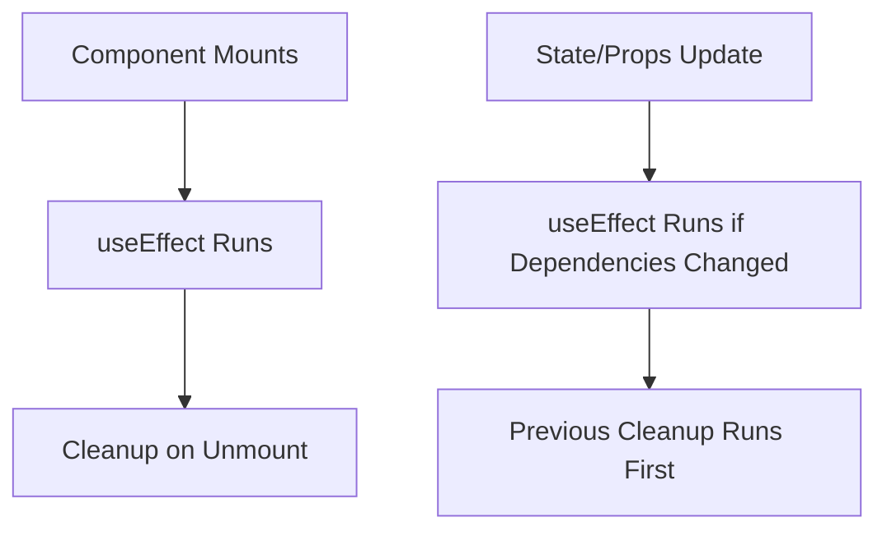
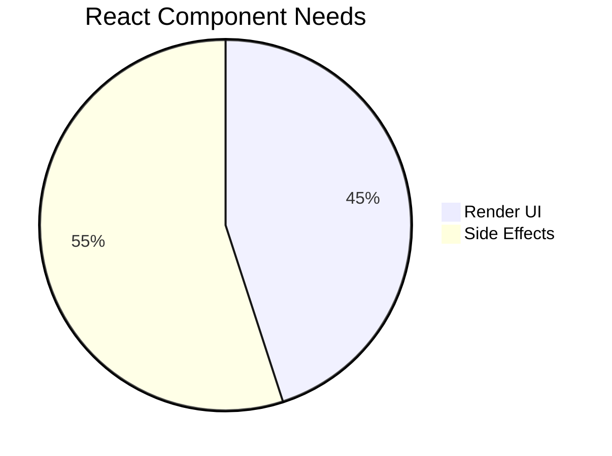
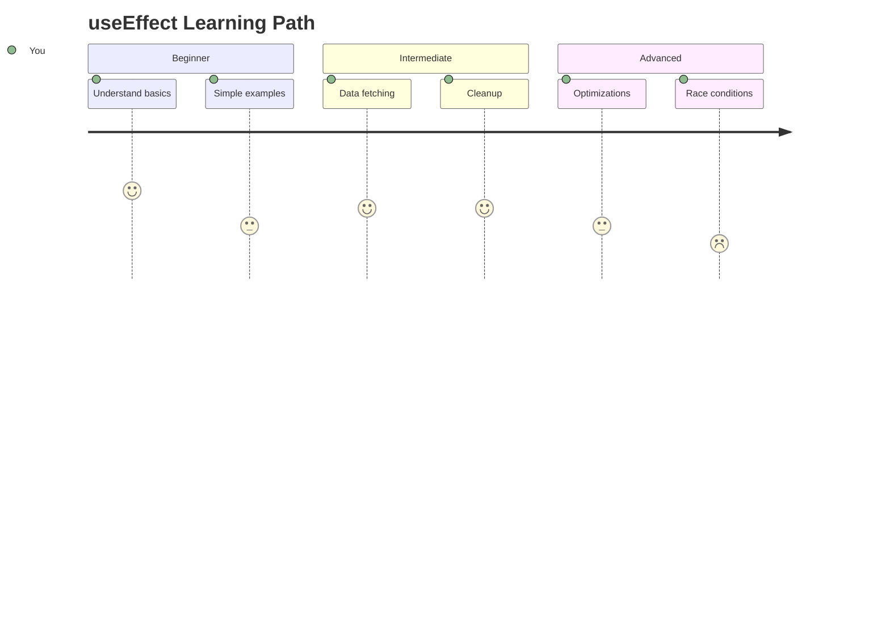

# 🎯 Mastering React's `useEffect` Hook: The Complete Guide  
*A journey from beginner to expert-level mastery*

  
*(Visualizing useEffect's execution flow in a React component)*



## 🔍 Table of Contents  
1. [🌱 Introduction](#-introduction)  
2. [🛠️ Basic Usage](#%EF%B8%8F-basic-usage)  
3. [⚡ Dependency Array Deep Dive](#-dependency-array-deep-dive)  
4. [🧹 Cleanup Functions](#-cleanup-functions)  
5. [🚀 Real-World Patterns](#-real-world-patterns)  
6. [⚠️ Common Pitfalls](#%EF%B8%8F-common-pitfalls)  
7. [🏎️ Performance Optimization](#%EF%B8%8F-performance-optimization)  
8. [🎓 Interview Prep](#-interview-prep)  
9. [🔮 Advanced Concepts](#-advanced-concepts)  

## 🌱 Introduction  
### Why `useEffect` Exists  


React components need to:  
✅ Render UI (via JSX)  
✅ Manage state (via `useState`)  
✅ Handle side effects (via `useEffect`)  

**Side Effects Examples:**  
- Data fetching  
- Subscriptions  
- Manual DOM changes  
- Timers  

### Component Lifecycle & `useEffect`  
```jsx
function Component() {
  useEffect(() => {
    // Runs after render
    return () => { /* Cleanup */ };
  }, [dependencies]);

  return <div>Content</div>;
}
```

| Lifecycle Phase       | `useEffect` Behavior          |
|-----------------------|-------------------------------|
| Mount                 | Runs after first render       |
| Update                | Runs if dependencies change   |
| Unmount               | Cleanup function executes     |

## 🛠️ Basic Usage  
### Simple Data Fetching Example  
```jsx
function UserProfile({ userId }) {
  const [user, setUser] = useState(null);

  useEffect(() => {
    const fetchUser = async () => {
      const response = await fetch(`/api/users/${userId}`);
      setUser(await response.json());
    };

    fetchUser();
  }, [userId]); // Re-runs when userId changes

  return <div>{user ? user.name : 'Loading...'}</div>;
}
```

<details>
<summary>📌 Key Takeaways</summary>

1. Effects run **after** render  
2. Always specify dependencies to avoid bugs  
3. Async functions need separate declaration inside  
</details>

## ⚡ Dependency Array Deep Dive  
### Dependency Array Patterns  
```jsx
// 1. Run once (on mount)
useEffect(() => { /* ... */ }, []);

// 2. Run when `value` changes
useEffect(() => { /* ... */ }, [value]);

// 3. Run after every render (rarely needed)
useEffect(() => { /* ... */ });
```

<details>
<summary>🛑 Common Mistakes Checklist</summary>

- [ ] Forgetting dependencies  
- [ ] Including unnecessary dependencies  
- [ ] Using objects/arrays directly in dependencies  
- [ ] Not handling cleanup for ongoing effects  
</details>

## 🧹 Cleanup Functions  
### Event Listener Example  
```jsx
function ResizeLogger() {
  useEffect(() => {
    const handleResize = () => console.log(window.innerWidth);
    
    window.addEventListener('resize', handleResize);
    
    return () => {
      window.removeEventListener('resize', handleResize);
    };
  }, []);

  return <div>Check console for resize events</div>;
}
```

**Cleanup Timing:**  
1. Before re-running effect (if deps change)  
2. Before component unmounts  

## 🚀 Real-World Patterns  
### Pattern 1: Debounced Search  
```jsx
function SearchBox() {
  const [query, setQuery] = useState('');
  const [results, setResults] = useState([]);

  useEffect(() => {
    if (!query) return;
    
    const timerId = setTimeout(() => {
      fetchResults(query).then(setResults);
    }, 500);

    return () => clearTimeout(timerId);
  }, [query]);

  return (
    <div>
      <input value={query} onChange={(e) => setQuery(e.target.value)} />
      <ResultsList data={results} />
    </div>
  );
}
```

### Pattern 2: Analytics Tracking  
```jsx
function ProductPage({ productId }) {
  useEffect(() => {
    trackPageView(`/products/${productId}`);
    
    return () => {
      trackPageLeave(`/products/${productId}`);
    };
  }, [productId]);
  
  // ...
}
```

## ⚠️ Common Pitfalls  
### Stale Closure Example  
```jsx
function Counter() {
  const [count, setCount] = useState(0);

  useEffect(() => {
    const interval = setInterval(() => {
      // ❌ Always sees initial count value
      setCount(count + 1);
    }, 1000);

    return () => clearInterval(interval);
  }, []); // Missing count dependency

  // ✅ Solution: Use functional update
  // setCount(c => c + 1);
}
```

**Anti-Patterns to Avoid:**  
1. Using state/props in effects without dependencies  
2. Performing side effects during render  
3. Forgetting cleanup for persistent effects  

## 🏎️ Performance Optimization  
### Optimizing Heavy Computations  
```jsx
function DataVisualization({ dataset }) {
  const [processedData, setProcessedData] = useState(null);

  useEffect(() => {
    // Web Worker for off-thread processing
    const worker = new Worker('data-processor.js');
    
    worker.postMessage(dataset);
    worker.onmessage = (e) => setProcessedData(e.data);
    
    return () => worker.terminate();
  }, [dataset]);

  // ...
}
```

**Optimization Techniques:**  
✔️ Memoize expensive calculations with `useMemo`  
✔️ Throttle/debounce rapid updates  
✔️ Use `useCallback` for stable function references  
✔️ Split effects by concern  

## 🎓 Interview Prep  
### MCQ Section  
1. When does useEffect cleanup run?  
   a) Before component unmounts  
   b) Before re-running the effect  
   c) Both a and b  
   d) Never  

   **Answer: c) Both a and b**  

2. What's wrong with this code?  
   ```jsx
   useEffect(async () => {
     const data = await fetchData();
     setState(data);
   }, []);
   ```  
   a) Missing dependency  
   b) Can't use async directly in useEffect  
   c) No cleanup  
   d) All of above  

   **Answer: b) Can't use async directly in useEffect**  

### Descriptive Questions  
**Q: Explain the difference between `useEffect` and `useLayoutEffect`**  
*A: `useEffect` runs asynchronously after render paints, while `useLayoutEffect` runs synchronously before paint. Use the latter when you need to read layout or perform mutations that must be visible immediately.*

## 🔮 Advanced Concepts  
### Chained Effects Pattern  
```jsx
function UserDashboard({ userId }) {
  const [user, setUser] = useState(null);
  const [posts, setPosts] = useState([]);

  // Chain 1: Load user
  useEffect(() => {
    fetchUser(userId).then(setUser);
  }, [userId]);

  // Chain 2: Load posts after user is available
  useEffect(() => {
    if (user?.needsPosts) {
      fetchPosts(userId).then(setPosts);
    }
  }, [user, userId]);

  // ...
}
```

### Race Condition Solution  
```jsx
useEffect(() => {
  let isActive = true;
  
  fetchData().then(data => {
    if (isActive) setData(data);
  });

  return () => { isActive = false; };
}, [dependency]);
```

## 🎁 Tech Stack Summary  
| Technology | Integration with `useEffect` |
|------------|-----------------------------|
| React Query | Replaces data fetching effects |
| Redux | Side effects in middleware |
| Axios | Cancel tokens in cleanup |
| WebSockets | Close connection in cleanup |
| GSAP | Animation cleanup |

## 👤 Author Bio  
  
**Jane Doe**  
React Expert & Educator  
[GitHub](https://github.com/yourusername) | [Twitter](https://twitter.com/yourhandle)  

> "Mastering `useEffect` is understanding the rhythm of React's composition model."  

## 🏁 Next Steps  
✅ Build a chat app with real-time updates  
✅ Create a custom hook using `useEffect`  
✅ Experiment with the React Profiler  
✅ Read the official [React docs](https://reactjs.org/docs/hooks-effect.html)  


